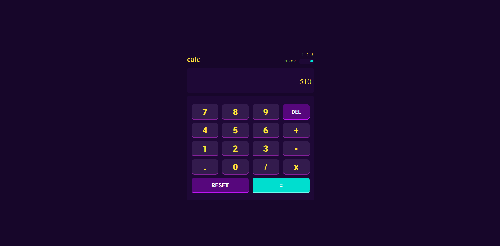
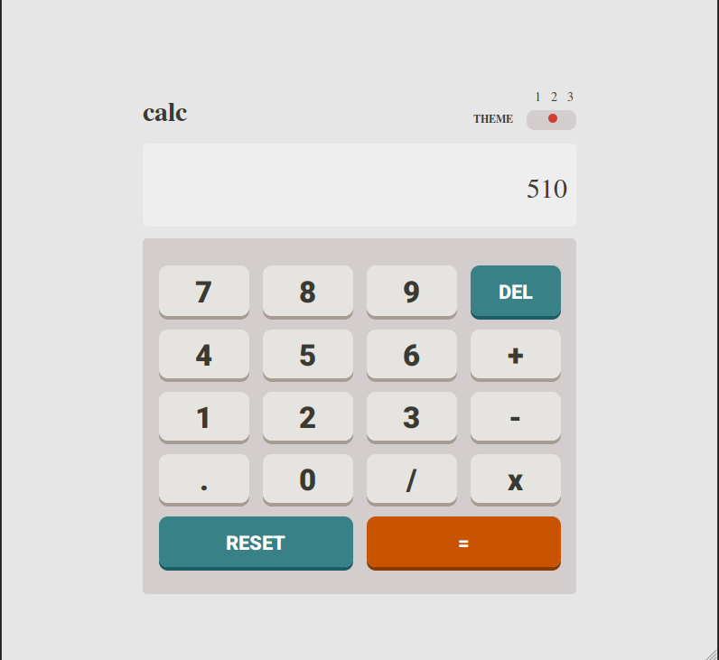
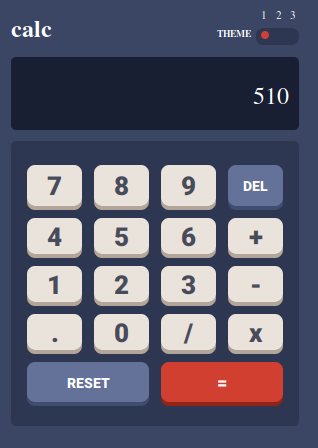

# Another Calculator

I've taken Frontend-Mentor challenge [challenge link](https://www.frontendmentor.io/challenges/calculator-app-9lteq5N29]) and created this calculator.

## Table of contents

- [Overview](#overview)
  - [The challenge](#the-challenge)
  - [Screenshot](#screenshot)
  - [Links](#links)
- [My process](#my-process)
  - [Built with](#built-with)
  - [Useful resources](#useful-resources)
- [Author](#author)

## Overview

### The Challenge

Users should be able to:

- See the size of the elements adjust based on their device's screen size
- Perform mathmatical operations like addition, subtraction, multiplication, and division
- Adjust the color theme based on their preference
- Have their theme preference check and saved

### Screenshot

### Links

- [Solution URL](https://github.com/yusufipk/another-calculator)
- [Live Site URL](https://yusufipk.github.io/another-calculator/)

## My process

### Built With

- HTML5
- CSS custom properties
- Grid
- Flexbox
- Desktop-first workflow

### Useful Resources

- [Saving theme with localstorage](https://dev.to/mritunjaysaha/theme-switching-using-local-storage-13i) - This article shows you how to save themes using localstorage.

## Author

- Website - [Yusuf İpek](https://yusufipek.me)
- Frontend Mentor - [@yusufipk](https://www.frontendmentor.io/profile/yusufipk)
- Youtube - [Youtube](https://www.youtube.com/channel/UCVBX2n_5egE9XuJL8NUS0Xg)
